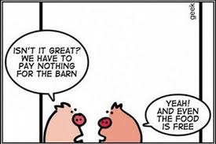

## Marketing upside down

<table border="0"> 
  <tr>
   <td>

   </td>
   <td>In the current systems you think to get a product for free, but actually you are a product which generates more than 1000 USD per year for the current internet company's.
   </td>
  </tr>
</table>

In our system, you pay for the digital resources you use e.g. storage, network and compute capacity.

The person or company who wants to sell a service can broadcast their offering through opt-in marketing channels.

In our new Internet/IT system, a user gets rewarded for looking around and investigating which products or services to buy.

You choose which channels are interesting to your current needs and receives money for actually looking at the offerings. E.g. I am looking to rent an apartment in a certain location or I am looking for a web designer or … I will allow publishers to send information to me.

Result

*   Merchant will pay much less for marketing his products
*   The consumer will receive money for shopping which could be more than the cost of running a 3Bot.

Basically, this system puts the marketing world upside down and has benefits for consumers and merchants but not for the intermediaries which often don’t have a lot of added value yet still reap most of the benefits.
