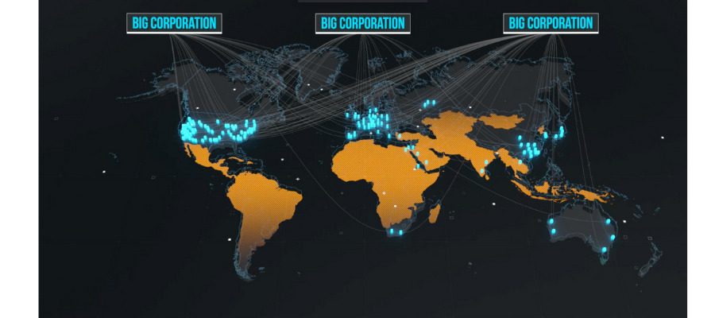

# The need for a New Peer-to-Peer Internet Grid 

## The Problem 

Originally the Internet was created to be open in access, for everyone, and by everyone. While it was the case for a while, it isn't anymore. People are turned into products by a centralized model that is unsustainable and way too complex. 

The Internet is growing at an accelerated rate. To service this demand, a few large companies (Google, Amazon, Alibaba, Facebook, etc.) have built and continue to build hyper-scale, power-hungry and centralized data centers. These data centers make up the majority of all Internet capacity available today.

This Internet infrastructure is very badly distributed, generally located only in the most developed regions of this world. Despite being a human right, only half of the global population has Internet access today. The Internet became the biggest source of information and value, it is therefore important to have an architecture that is scalable and affordable to all - something that is not the case today.

The Internet is expanding at such a rapid pace, that even the cloud giants can't cope with it. The creation of hyper-scale data centers takes time and costs billions. And that doesn't even take into consideration all the externalities, as the Internet consumes about 10% of global energy resources. Therefore, in an age of climate change and where user data is not safe anymore, we need to find a more sustainable and sovereign solution.

## The ThreeFold_Grid is the foundation for a better Internet

The ThreeFold_Grid is a peer-to-peer and autonomous Internet grid that provides game-changing performance and empowers new possibilities. With +14,000 CPU cores and +80,000,000 GB of online storage distributed across 110+ locations in 21+countries, the ThreeFold_Grid is the largest peer-to-peer network of Internet (compute, storage and network) capacity in the world. See the live capacity of the ThreeFold_Grid [here](https://explorer.threefold.io).

ThreeFold is restoring the neutrality of the Internet by expanding a peer-to-peer grid that:
- Enables users to protect their data
- delivers better performance and security than current alternatives.
- is sustainable for our planet.

Features of the ThreeFold_Grid:
- **Peer-to-Peer**: No intermediaries anymore. On the TF Grid, consumers go directly to the source. So, for example, if two friends call each other on a secure peer-to-peer application that lives on the TF Grid, only they will have access to data about the call, no one else – not even us!
- **Decentralized**: The TF Grid's capacity is distributed across 20+ countries at launch. ThreeFold's decentralized architecture brings many benefits such as security, cost-efficiency, sustainability, and much more. The expansion and reach to regions that need Internet capacity the most will be incentivized and/or sponsored by the Foundation.
- **Autonomous**: Because it is self-sustainable and self-healing, the TF Grid is extremely resilient and enables data to be available even in the unlikely case a node on which data is stored goes down. The first of its kind, the TF Grid autonomous technology removes all the layers of complexity present in the current Internet.
- **Private & Secure**: By removing the need for human intervention, we eliminated many backdoors present in the current architecture. Combined with the peer-to-peer and autonomous approach, users benefit from an incredibly private digital life.
- **Efficient**: Less is more. By reducing the layers of complexity, the TF Grid enables code and development up-to 10x faster.
- **Equal**: Internet access should be available to everyone. The TF Grid solutions position themselves as the most affordable on the market. As mentioned above, the expansion of the TF Grid to remote regions of our world will be incentivized and/or sponsored by the Foundation.
- **Sustainable**: The TF Grid is up-to 90% more sustainable than centralized alternatives on the market.

> And you can become a part of this solution by [becoming a farmer](become_a_farmer) and adding more decentralized capacity to the ThreeFold_Grid.

!!!include:grid_toc